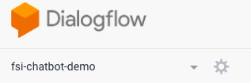
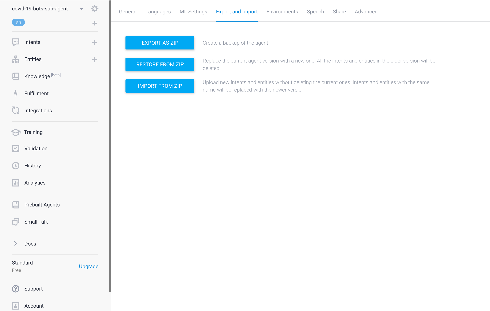
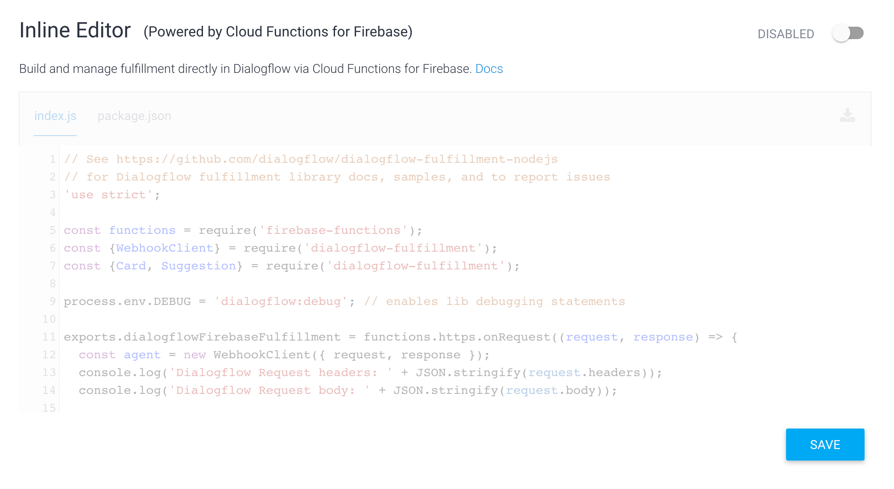
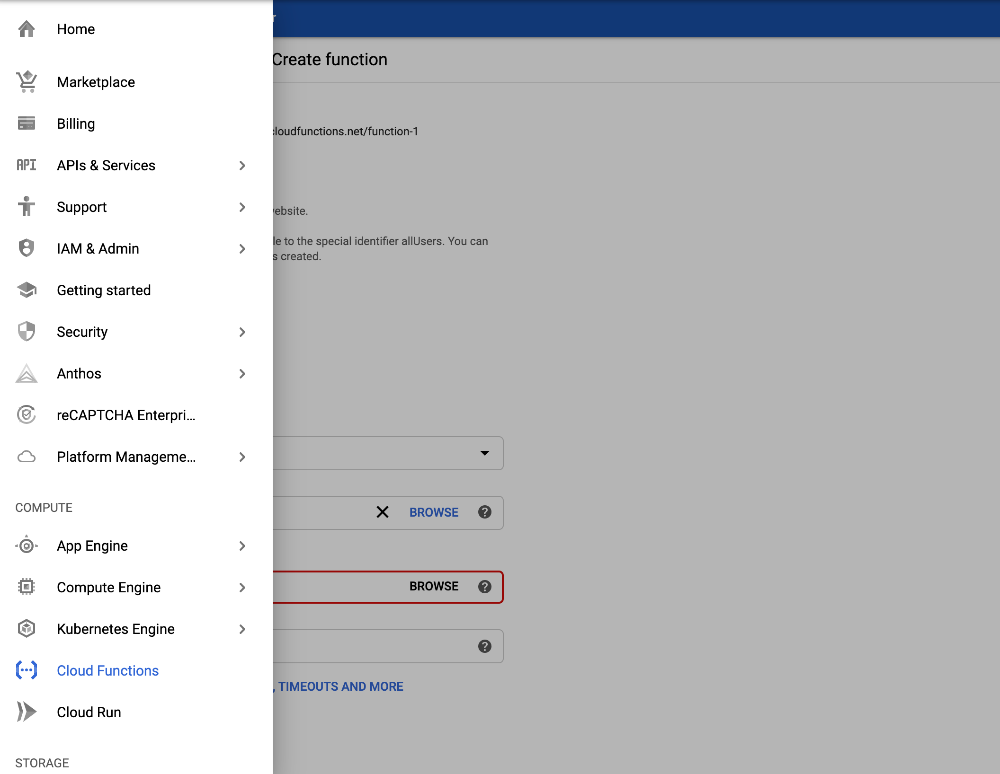
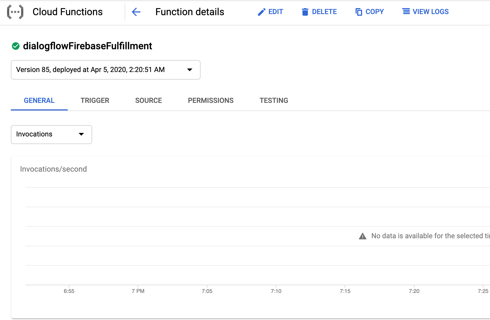
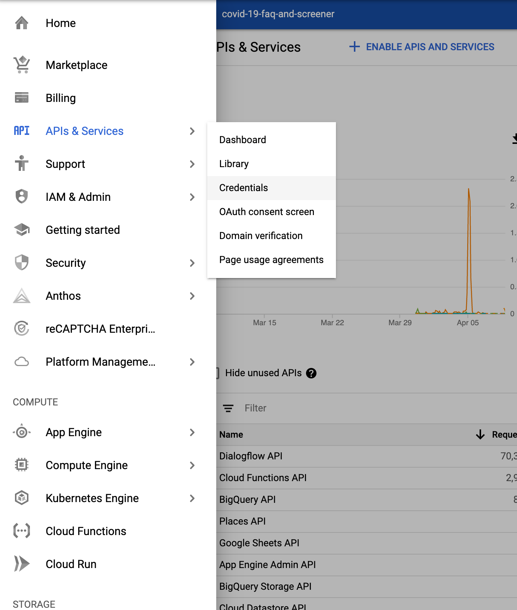
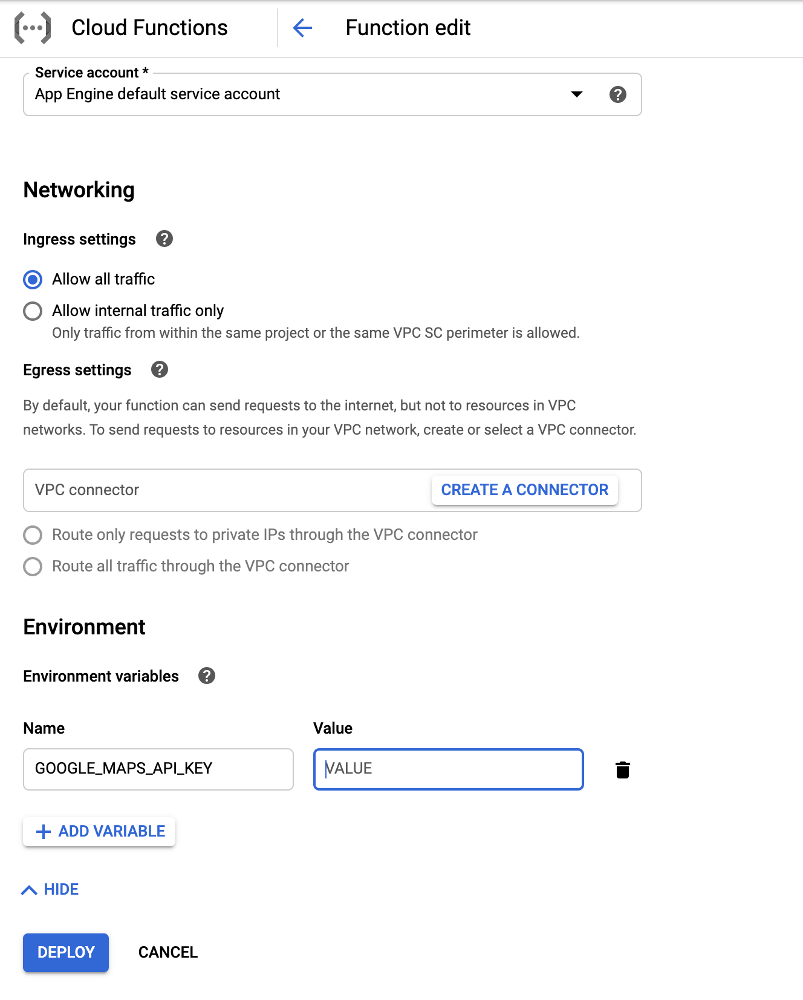
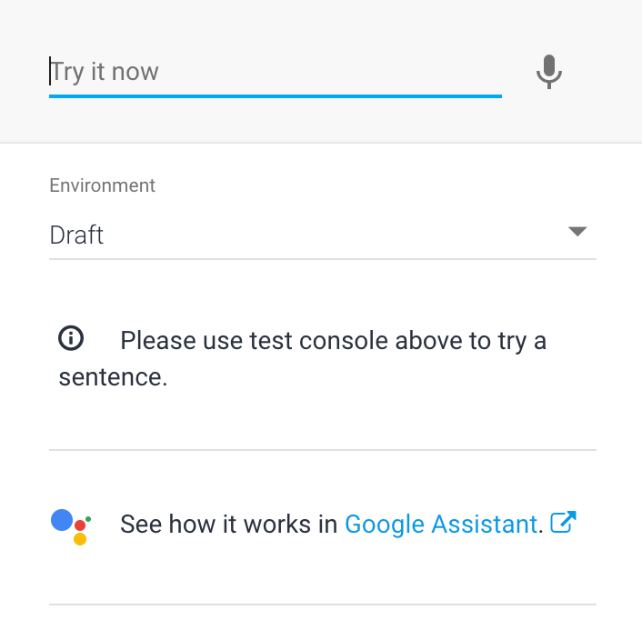

<!--
  Licensed to the Apache Software Foundation (ASF) under one or more
  contributor license agreements.  See the NOTICE file distributed with
  this work for additional information regarding copyright ownership.
  The ASF licenses this file to You under the Apache License, Version 2.0
  (the "License"); you may not use this file except in compliance with
  the License.  You may obtain a copy of the License at

      http://www.apache.org/licenses/LICENSE-2.0

  Unless required by applicable law or agreed to in writing, software
  distributed under the License is distributed on an "AS IS" BASIS,
  WITHOUT WARRANTIES OR CONDITIONS OF ANY KIND, either express or implied.
  See the License for the specific language governing permissions and
  limitations under the License.
-->
# Rapid Response Virtual Agent Templates 
Google has launched a Dialogflow 
templates repository for financial service customers enabling chat or voice bots to respond to customer questions.
This repository contains sample Dialogflow agents for financial instutions in banking, insurance and capital markets.

## Requirements
The answers provided in these Dialogflow agents are generic and do not constitute medical, legal or financial advice. 
Furthermore, it is expected that the customer changes the answers to **ALL** questions
to suit their specific situation. 

## Agent Templates
Each agent has its own directory. Review the README in each directory for your institution type for more information.

* [Rapid Response Banking Virtual Agent Template](./agent-template-banking)
* [Rapid Response Insurance Virtual Agent Template](./agent-template-insurance)
* [Rapid Response Capital Markets Agent Template](./agent-template-capital-markets)

## Agent Deployment
Google provides the [Rapid Response Dialogflow Virtual Agent 
template (the "Template"), in the `agent-template-*` directories so you 
can select the template that suits or organization, import it into your own Dialogflow agent and update it to suit your requirements.

### Import the Rapid Response Banking Dialogflow Virtual Agent Template into Your Agent
1. Download the `Rapid Response Dialogflow Agent Template` zip file located in the `agent-template-*` directories for your institution type.

2. Create a new agent by selecting the drop down menu in the top left corner and then click **Create new agent**.

3. Click the Settings icon.

4. Select the **Export and Import** tab, then click the **IMPORT FROM ZIP** button to 
import the agent template.

### Import and Deploy Fulfillment into Your Agent
1. Download Fulfillment from the `Dialogflow Fulfillment` folder located in the `agent-template-*` directories.

2. Click **Fulfillment** in the left sidebar.

3. Toggle the switch to enable the Inline Editor.

4. Follow the instruction on the screen to enable fulfillment via Cloud 
Functions and enable billing for the Cloud project.

5. Go to the Google Cloud Console and select Cloud Functions on the left panel.

6. Select the fulfillment and click Edit button.

7. Under the **Source code** section, select **ZIP upload** and upload the 
fulfillment zip file downloaded at step 1. Then select a **Staging bucket** (you may need to create one if it hasn't been created yet).

8. [Optional] Follow [Quickstart](https://developers.google.com/maps/gmp-get-started#enable-api-sdk) to enable 
[Google Maps Places API](https://developers.google.com/places/web-service/intro) and [Geocoding API](https://developers.google.com/maps/documentation/geocoding/start) if you haven't completed this already. 

Go to GCP API & Services->Credentials component to create an API key for calling the **Google Maps Places API** and the **Geocoding API**
(More detailed instructions are listed at [Get an API Key](https://developers.google.com/places/web-service/get-api-key?hl=en_US)).

9. Set the GOOGLE_MAPS_API_KEY environment variable to the API key when you deploy Cloud Function. (More details can be found at  [Cloud Function Updating Environment Variable](https://cloud.google.com/functions/docs/env-var#updating_environment_variables))

## Integrate with Rapid Response Banking Virtual Agent Template

### Interact with the Dialogflow Console
Type your text query input in the Dialogflow Simulator. *Please note that custom payload of response may not show up on Dialogflow Console, you can click DIAGNOSTIC INFO to get more information about the response*.

### Integrate with [Dialogflow Messenger](https://cloud.google.com/dialogflow/docs/integrations/dialogflow-messenger)
Follow the [instructions here](https://github.com/GoogleCloudPlatform/covid19-rapid-response-demo#integrate-with-dialogflow-messenger).

### Integrate with this Chat App and other third-party service providers
There is a chat application that Google developed as a quick start guide that customers can use to build a customized chat interface and it
demonstrates how to integrate a custom chat UI with Dialogflow agents. Please follow this [documentation](https://github.com/GoogleCloudPlatform/covid19-rapid-response-demo#requirements) 
to deploy the chat application to your GCP account. 

*Please note this chat app is not an official Google product.* 

### Integrate with Twilio to provide the agent over SMS [optional]
You can deploy a Twilio to Dialogflow "bridge" running serverless Cloud Run to expose your agent over SMS. 
See the [these instructions](https://github.com/GoogleCloudPlatform/covid19-rapid-response-demo/tree/master/twilio-sms).

### Interaction with Dialogflow API
You can follow this [quick start](https://cloud.google.com/dialogflow/docs/quick/api) to interact with your agent using the Dialogflow API.
 
### Integrate Your Agent with Text-based Third-Party Conversation Platform
Dialogflow has integrated with various text-based conversation platforms such 
as Facebook, Telegram, Line, Slack, etc. You can follow instructions in the
[Integrations page](https://cloud.google.com/dialogflow/docs/integrations) to integrate 
with the platform of your choice.

### Integrate with Dialogflow phone Gateway
Dialogflow provides a one-click integration for a telephone interface to your 
agent by selecting a phone number hosted by Google. See our 
[documentation](https://cloud.google.com/dialogflow/docs/integrations/phone-gateway) 
for detailed instructions. Please note that if you expect your virtual agent to 
have a high call volume, request a toll-free phone number during the set up.

### Release Notes

## Google Cloud Disclaimer: 
The contents of this GitHub repository are provided under the Apache 2.0 license. 
